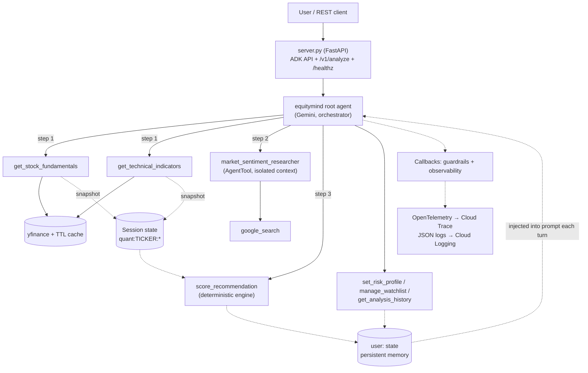

# EquityMind 📊

**A professional-grade financial-analyst agent** built on [Google ADK](https://google.github.io/adk-docs/) + Gemini. Ask *"Should I buy AAPL?"* and it runs a strict 3-step loop. It gathers quantitative fundamentals and technicals, then 48-hour news sentiment, then synthesises a **BUY / SELL / HOLD** scorecard with a transparent, deterministic scoring model.

[](../../actions/workflows/ci.yml)

---

## Architecture



### Request lifecycle
1. **Ticker guardrail.** `before_tool_callback` normalises the symbol (`$brk-b` → `BRK-B`) and rejects malformed input before any network call.
2. **Quantitative lookup.** Fundamentals and technicals are fetched (callable in parallel), cached for 5 minutes, and snapshotted into session state.
3. **Sentiment lookup.** A sub-agent with Google Search returns a dated, sourced report ending in `SENTIMENT_LABEL`. Raw search results stay out of the root context.
4. **Decision synthesis.** `score_recommendation` reads the stored numbers, so the LLM cannot inject made-up figures. It **refuses to run until steps 1–2 are done**, applies risk-profile weights, and writes the result to long-term memory.
5. **Disclaimer guardrail.** `after_model_callback` guarantees the mandatory disclaimer on every final response.

---

## How this project meets each evaluation criterion

### 1. Tool & Interface Design
| Tool | Purpose | Design notes |
| :--- | :--- | :--- |
| `get_stock_fundamentals` | P/E, dividend yield, D/E, EPS trend, growth, margins | Unit-normalised (D/E ratio, yield %); `"Data unavailable"` instead of nulls |
| `get_technical_indicators` | SMA 50/200, cross, RSI-14, MACD, returns, volatility | Pure `compute_technicals()` core for testability |
| `market_sentiment_researcher` | 48h headlines + analyst actions | `AgentTool` around `google_search` (built-in search can't share an agent with function tools) |
| `score_recommendation` | Final BUY/SELL/HOLD | `Literal` enum args → JSON-schema enums; deterministic & explainable |
| `set_risk_profile`, `manage_watchlist`, `get_analysis_history` | Memory | Enum-constrained actions, idempotent ops |

- Every tool returns a uniform `{"status": "success"|"error", ...}` envelope with actionable `error_message`s that tell the LLM what to do next.
- Rich docstrings become the tool descriptions. `tool_context` is hidden from the model's schema.
- **HTTP interfaces:** the full ADK API (`/run`, `/run_sse`, sessions), plus the typed `POST /v1/analyze` (Pydantic request/response) and `GET /v1/users/{id}/memory`.

### 2. Context & Memory
| Tier | ADK mechanism | Used for |
| :--- | :--- | :--- |
| Long-term (cross-session) | `user:` state prefix + `DatabaseSessionService` (SQLite/Postgres) | Risk profile, watchlist, last 20 analyses |
| Session | un-prefixed state | `quant:<TICKER>:*` data snapshots, `last_ticker` for follow-ups ("what about its debt?") |
| Invocation / telemetry | `obs:*` counters | LLM calls, tokens, tool errors |

- **Dynamic context injection.** An `InstructionProvider` rebuilds the system prompt each turn with today's date and a compact `USER CONTEXT` block covering risk profile, watchlist, and the last 5 calls. The agent can say *"Last week you asked about NVDA; it was a HOLD at $118"*.
- **Context-window hygiene.** Search results stay in the sub-agent, history is capped, and only 5 recent analyses are injected.

### 3. Orchestration & Logic
- **Enforced procedural loop.** The prompt mandates the order, *and* `score_recommendation` deterministically refuses until both quant snapshots exist, returning a self-correcting error that names the missing steps.
- **Hybrid reasoning.** The LLM handles language tasks: ticker resolution, news reading, and the narrative. Python handles arithmetic and the decision itself.
- **Scoring model** (`tools/scoring.py`): each category score is the mean of signals in [-1, 1].

  | Profile | Fundamentals | Sentiment | Technicals | BUY ≥ | SELL ≤ |
  | :--- | :---: | :---: | :---: | :---: | :---: |
  | conservative | 0.5 | 0.2 | 0.3 | 0.35 | -0.20 |
  | moderate (default) | 0.4 | 0.3 | 0.3 | 0.25 | -0.25 |
  | aggressive | 0.3 | 0.3 | 0.4 | 0.20 | -0.30 |

  Confidence combines data coverage with distance from the threshold.
- **Multi-ticker comparisons**, company-name resolution, unknown-ticker handling (no scorecard), and out-of-scope refusal.
- **Guardrails as code:** ticker validation (`before_tool_callback`) and a guaranteed disclaimer (`after_model_callback`).

### 4. Observability & Tracing
- **OpenTelemetry tracing.** ADK's native spans (`invoke_agent`, `call_llm`, `execute_tool`) carry child spans `market_data.fundamentals|technicals` with `ticker`, `cache_hit`, and `provider_latency_ms`. Callbacks add `llm.total_tokens`, `llm.latency_ms`, and `tool.status`.
- **Cloud Trace export.** Set `EQUITYMIND_TRACE_TO_CLOUD=true` (enabled in the Cloud Run deploy) or run `adk web --trace_to_cloud`.
- **Structured JSON logs.** One line per `llm_call` / `tool_call` / `analyze_request`, including `trace_id` / `span_id` for log↔trace correlation, plus `invocation_id`, `session_id`, latency, tokens, and the recommendation.
- **Live metrics in state** (`obs:llm_calls`, `obs:total_tokens`, `obs:tool_calls`, `obs:tool_errors`), visible in the ADK Web UI *State* tab. Event and trace views are in its *Trace* tab.
- **Agent evals** (`evals/run_eval.py`) score tool-trajectory order and response format, then write JSON reports.

### 5. Infrastructure & CI/CD
- **12-factor config** (`config.py`), `uv` lockfile, and a `Makefile` for every workflow.
- **Dockerfile:** multi-stage, non-root user, layer-cached `uv` installs, `HEALTHCHECK`.
- **CI** (`.github/workflows/ci.yml`): ruff lint and format checks, then pytest on Python 3.11 and 3.12 with an **80% coverage gate**. It also builds the Docker image and smoke-tests `/healthz`. Live agent evals run with a ≥ 80% pass-rate gate when the `GOOGLE_API_KEY` secret is set.
- **CD** (`.github/workflows/deploy.yml`): keyless GitHub→GCP auth via Workload Identity Federation, then push to Artifact Registry. Next comes a **tagged no-traffic Cloud Run revision**, an authenticated smoke test, and **promotion to 100%** (instant rollback by re-tagging).
- **IaC bootstrap** (`deploy/setup_gcp.sh`): an idempotent script that sets up APIs, Artifact Registry, Secret Manager, and least-privilege runtime/deploy service accounts, plus the WIF pool.
- Dependabot covers pip, Actions, and Docker.

---

## Quick start

```bash
uv sync
cp equitymind/.env.example equitymind/.env      # add GOOGLE_API_KEY
make web                                         # ADK Web UI → http://localhost:8000, pick "equitymind"
```

Other entry points:

```bash
make run        # terminal chat
make serve      # production server on :8080 with persistent SQLite sessions
curl -s localhost:8080/v1/analyze -H 'content-type: application/json' \
     -d '{"ticker":"AAPL","user_id":"raj"}' | jq -r .scorecard_markdown
```

Try these prompts:
- `Should I buy AAPL?`
- `I'm a conservative investor — compare KO vs PEP.`
- `Add NVDA to my watchlist.` → new session → `What's on my watchlist and what did you say about NVDA last time?`
- `Should I buy ZZXQW?` (unknown ticker → no scorecard, asks for clarification)

## Testing

```bash
make test       # 48 offline tests (yfinance mocked), ~2s
make cov        # coverage report (~95%)
make eval       # live end-to-end agent evals (needs API key)
make lint
```

## Deploy

```bash
PROJECT_ID=my-proj GITHUB_REPO=rajushinde451/EquityMind GOOGLE_API_KEY=... ./deploy/setup_gcp.sh
# add the printed GitHub variables; pushes to main now auto-deploy after CI passes
make deploy     # or deploy manually from source
```

## Project layout

```
equitymind/
  agent.py           root orchestrator + sentiment sub-agent, callback wiring
  prompt.py          system prompts + per-turn memory injection
  config.py          env-driven settings
  guardrails.py      ticker validation, disclaimer enforcement
  observability.py   JSON logging, OTel attributes, state metrics
  tools/
    market_data.py   fundamentals + technicals (cache, spans, state snapshots)
    scoring.py       deterministic BUY/SELL/HOLD engine
    memory.py        risk profile, watchlist, analysis history
server.py            FastAPI: ADK API, /v1/analyze, /healthz, memory endpoint
evals/               live agent eval cases + runner
tests/               offline unit/integration tests
deploy/setup_gcp.sh  GCP bootstrap (WIF, SAs, secrets, registry)
.github/workflows/   CI + Cloud Run CD
```

> *Disclaimer: I am an AI, not a certified financial advisor. This analysis is for informational purposes only. Invest at your own risk.*
